# Claude Code Starter

> 🇬🇧 English (this file) · 🇻🇳 [Tiếng Việt](README.vi.md)

**A production-ready template for starting any project with [Claude Code](https://claude.ai/claude-code).** Clone it, run `claude`, and start building on a sane default: a fill-in `CLAUDE.md`, security permissions that block dangerous commands, quality + security rules, and a set of opt-in [extras](extras/) (status line, hooks, sandbox, skills, subagents) you add only when you want them.

[](LICENSE)
[](https://claude.ai/claude-code)
[](#optional-extras)
[](https://ongboit.com/)

Works for everyone: developers, content creators, marketers, and anyone learning Claude Code.

### Why this starter

- **Fewer AI mistakes by default.** The behavioral rules in `.claude/rules/AGENT.md` build on [Andrej Karpathy's four principles](https://github.com/multica-ai/andrej-karpathy-skills): Claude states its assumptions, keeps changes minimal and surgical, and verifies its own work instead of guessing.
- **Safe from the first prompt.** `.claude/settings.json` blocks destructive commands and asks before `git push`; a security rule and an optional hook keep your `.env` and keys out of Claude's reach.
- **Batteries included, opt-in.** The core is enough to start. Everything else lives in `extras/` — each add-on has its own README and a link to a full guide, so you copy in only what you need.
- **Language-agnostic.** Python, Go, JS, Ruby, or no code at all. Fill in Tech Stack + Commands and go.

## The four principles



These four principles, adapted from Karpathy's repo, are the heart of `.claude/rules/AGENT.md`. In plain terms:

1. **Think Before Coding** — state assumptions, surface tradeoffs, ask when unclear instead of guessing.
2. **Simplicity First** — the minimum code that solves the problem; nothing speculative.
3. **Surgical Changes** — touch only what the task needs; don't "improve" unrelated code.
4. **Goal-Driven Execution** — define success, then verify every claim (file exists? test passes?) before saying "done".

## Who this is for

- **New to Claude Code** — you get a working setup and a guided 10-step tutorial (`FIRST-PROMPTS.md`) instead of a blank folder.
- **Developers** — drop `.claude/` + `CLAUDE.md` into any repo, run `/init`, and Claude works with guardrails and quality rules from prompt one.
- **Content creators & marketers** — the same discipline (no fabrication, human-in-the-loop, safe file handling) applies to writing and automation work, not just code.

## Table of Contents

- [Quick Start](#quick-start-3-minutes)
- [What's Inside](#whats-inside)
- [Optional Extras](#optional-extras)
- [How It Works](#how-it-works)
- [Customize for Your Project](#customize-for-your-project)
- [First Project Ideas](#first-project-ideas)
- [Essential Commands](#essential-commands)
- [Learn More](#learn-more)
- [FAQ](#faq)
- [License](#license)

## Quick Start (3 minutes)

### Prerequisites

- [Claude Code installed](https://ongboit.com/cai-dat-claude-code/) (Pro plan $20/mo recommended)
- Git installed

### Option A: Download (no Git required)

```bash
# Download and extract
curl -L https://github.com/thenguyenvn90/claude-code-starter/archive/refs/heads/main.zip -o starter.zip
unzip starter.zip
mv claude-code-starter-main my-project
cd my-project
```

### Option B: Git clone

```bash
git clone https://github.com/thenguyenvn90/claude-code-starter.git my-project
cd my-project
```

### Then start building

```bash
# Start Claude Code
claude

# Let Claude analyze your project and customize CLAUDE.md
/init

# Start building! Copy a prompt from FIRST-PROMPTS.md or describe what you want.
```

## What's Inside

| File | Purpose |
|------|---------|
| `CLAUDE.md` | Project brain. Claude reads this every session. Edit to match your project. |
| `.claude/settings.json` | Security permissions. Blocks dangerous commands, asks before git push. |
| `.claude/rules/AGENT.md` | Behavioral guidelines (the four principles). How Claude should think and change code. |
| `.claude/rules/quality.md` | Code quality rules. Applied to all files automatically. |
| `.claude/rules/security.md` | Secrets, input validation, and AI-generated-code checks. |
| `.claude/rules/multi-agent.md` | Rules for when you run parallel subagents. |
| `.gitignore` | Keeps secrets and personal configs out of git. |
| `FIRST-PROMPTS.md` | 10 copy-paste prompts to build your first app step by step. |
| `extras/` | **Optional** add-ons (status line, hooks, sandbox, skills, subagents). See below. |

## Optional Extras



The core above is enough to start. When you want more, `extras/` has opt-in add-ons — each with its own README and a link to a full guide on ongboit.com. Copy in only what you need.

| Extra | What it does | Guide |
|---|---|---|
| [`extras/statusline/`](extras/statusline/) | Status bar: model · %context · git branch | [Status line](https://ongboit.com/claude-code-status-line/) |
| [`extras/hooks/`](extras/hooks/) | Hook that blocks reading `.env` / keys | [Hooks](https://ongboit.com/claude-code-hooks/) |
| [`extras/sandbox/`](extras/sandbox/) | Run bash sandboxed (fewer prompts, safer) | [Sandbox](https://ongboit.com/claude-code-sandbox/) |
| [`extras/skills/`](extras/skills/) | Example skill (`commit-helper`) | [Skills](https://ongboit.com/claude-code-skills/) |
| [`extras/subagents/`](extras/subagents/) | Example subagent (`code-reviewer`) | [Subagent best practices](https://ongboit.com/claude-code-subagent-best-practices/) |

**Install as a plugin (optional):** the curated skills are also available via Claude Code's plugin system:

```
/plugin marketplace add thenguyenvn90/claude-code-starter
/plugin install claude-code-starter
```

## How It Works

1. **CLAUDE.md** tells Claude what your project is, what tools you use, and how you work
2. **settings.json** protects you from accidental file deletion or secret exposure
3. **rules/quality.md** ensures Claude writes clean, consistent code
4. **FIRST-PROMPTS.md** gives you a guided path to build something real

After running `/init`, Claude will update CLAUDE.md with details it discovers about your project (build commands, file structure, dependencies).

## Customize for Your Project

Edit `CLAUDE.md` and fill in:

- **Project Name** — what you're building
- **Tech Stack** — your language, framework, database
- **Commands** — how to run, build, test your project
- **Current Focus** — what you're working on right now

Everything else (Decision Flow, Rules, Human-in-the-Loop) works out of the box.

## First Project Ideas

Not sure what to build? Check `FIRST-PROMPTS.md` for a guided 10-step tutorial to build a SaaS landing page. Or try these:

- **"Create a personal portfolio website"**
- **"Build a todo app with local storage"**
- **"Set up a blog with markdown files"**
- **"Create an API that returns quotes"**

## Essential Commands

Once inside Claude Code, these commands help you work efficiently:

| Command | What it does |
|---------|-------------|
| `/init` | Auto-generate CLAUDE.md from your codebase |
| `/help` | See all available commands |
| `/compact` | Compress conversation when it gets long |
| `/clear` | Start fresh conversation |
| `/cost` | Check token usage |
| `Shift+Tab` | Switch between Normal / Plan / Auto mode |

## Learn More

**Basics**
- [What is Claude Code?](https://ongboit.com/claude-code-la-gi/) — Full overview for beginners
- [Install Claude Code](https://ongboit.com/cai-dat-claude-code/) — Step-by-step installation guide
- [CLAUDE.md & .claude/ Config](https://ongboit.com/claude-md-la-gi/) — Deep dive into configuration
- [Permission Modes](https://ongboit.com/claude-code-permission-modes/) — 6 security levels explained
- [Save Tokens](https://ongboit.com/tiet-kiem-token-claude-code/) — Reduce costs by 50%+
- [Roadmap: Zero to Power User](https://ongboit.com/claude-code-roadmap/) — 8-level learning path

**Extras & power features** (used above)
- [Status line](https://ongboit.com/claude-code-status-line/) · [Hooks](https://ongboit.com/claude-code-hooks/) · [Sandbox](https://ongboit.com/claude-code-sandbox/)
- [Skills](https://ongboit.com/claude-code-skills/) · [Subagent best practices](https://ongboit.com/claude-code-subagent-best-practices/) · [API key trap](https://ongboit.com/claude-code-anthropic-api-key-env-trap/)
- [Spec-driven development](https://ongboit.com/claude-code-spec-driven/) · [Agent SDK](https://ongboit.com/claude-agent-sdk/) · [Claude Code in Slack](https://ongboit.com/claude-code-slack/)

## FAQ

**Q: Do I need to know how to code?**
No. Claude Code writes code for you. You describe what you want in plain English (or any language).

**Q: Is this free?**
The template is free. Claude Code requires a subscription ($20/mo Pro plan recommended).

**Q: What if I already have a project?**
Copy the `.claude/` folder and `CLAUDE.md` into your existing project. Run `/init` to customize.

**Q: Can I use this for Python/Go/Ruby projects?**
Yes. The template is language-agnostic. Just update Tech Stack and Commands in CLAUDE.md.

## License

MIT — use however you want.

---

Made with Claude Code by [Ong Bo IT](https://ongboit.com) 🇻🇳
